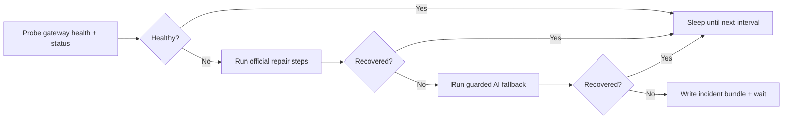

# fix-my-claw

[中文](README_ZH.md)

[](#requirements)
[](LICENSE)
[](CHANGELOG.md)
[](#how-it-works)

Keep OpenClaw healthy without babysitting it.

`fix-my-claw` is a self-healing watchdog for long-running OpenClaw hosts. It probes Gateway health, runs official repair steps first, keeps a timestamped incident bundle for every attempt, and only escalates to AI when the standard recovery path fails.

The default AI path now uses `acpx`, so the tool can verify and use coding agents such as Codex and Claude as part of a guarded repair flow instead of leaving that logic in shell notes and operator memory.

[Highlights](#highlights) • [Install](#install) • [Commands](#commands) • [Quick Start](#quick-start) • [How It Works](#how-it-works) • [Probe Mode](#probe-mode) • [Configuration](#configuration) • [Systemd](#systemd-deployment) • [Docs](#documentation)



<a id="highlights"></a>

## ✨ Highlights

- 🩺 **OpenClaw-aware checks** using `gateway health` and `gateway status --require-rpc`
- 🛠️ **Official-first recovery** with configurable repair steps before AI escalation
- 🤖 **AI fallback by default** through `acpx`, with automatic provider probing
- 🔍 **Real capability probing** via `fix-my-claw probe`, including auth-aware live dry-runs
- 📦 **Incident bundles** under `~/.fix-my-claw/attempts/<timestamp>/`
- 🧷 **Operational guardrails** for cooldowns, stale-lock cleanup, single-instance execution, and remote-mode safety
- 🖥️ **Service-friendly deployment** with bundled `systemd` units and timer files

## 🎯 What It Solves

If you already recover OpenClaw manually with commands like:

- `openclaw doctor --repair --non-interactive`
- `openclaw gateway restart`

then `fix-my-claw` turns that runbook into a repeatable control loop:

- it checks whether OpenClaw is healthy
- it runs the same official steps you would run manually
- it records what happened
- it only reaches for AI when the standard path fails

<a id="commands"></a>

## 🧰 Command Overview

| Command | What it does | Typical use |
| --- | --- | --- |
| `fix-my-claw up` | Initialize default config if missing, then start monitoring | One-command startup |
| `fix-my-claw monitor` | Run the long-lived monitor loop | systemd / background service |
| `fix-my-claw check` | Probe health once | Health check / scripting |
| `fix-my-claw probe` | Validate repair paths, commands, paths, and AI capability | Preflight / debugging |
| `fix-my-claw repair` | Run one repair attempt now | Manual intervention |
| `fix-my-claw init` | Write the default config | First-time setup |

<a id="install"></a>

## 🚀 Install

The simplest install path is directly from GitHub:

```bash
python3 -m venv .venv
source .venv/bin/activate
pip install git+https://github.com/caopulan/fix-my-claw.git
```

If you already have the repository checked out:

```bash
pip install .
```

<a id="requirements"></a>

## 📋 Requirements

- Python 3.9+
- OpenClaw installed and callable as `openclaw`
- Access to the OpenClaw workspace and state directories on the target host
- `acpx` installed if you want the default AI backend to be usable immediately
- Best deployed on the Gateway host itself

If `openclaw` is not on `PATH`, set `[openclaw].command` to an absolute path.

<a id="quick-start"></a>

## ⚡ Quick Start

Start the watchdog with the default config:

```bash
fix-my-claw up
```

That command creates `~/.fix-my-claw/config.toml` if needed, then enters the monitor loop.

Useful one-shot commands:

```bash
# Create the default config and print its path
fix-my-claw init

# Probe OpenClaw health once
fix-my-claw check --json

# Dry-run all configured repair paths, including AI backends
fix-my-claw probe --json

# Skip live AI calls and only validate static prerequisites / argv / syntax
fix-my-claw probe --no-live-ai --json

# Force one repair attempt now
fix-my-claw repair --force --json
```

Default paths:

- Config: `~/.fix-my-claw/config.toml`
- Log file: `~/.fix-my-claw/fix-my-claw.log`
- Incident bundles: `~/.fix-my-claw/attempts/<timestamp>/`

Example console output:

```text
00:05:52 | START  | mode=up config=/Users/me/.fix-my-claw/config.toml
00:05:52 | WATCH  | watching every 60s log=/Users/me/.fix-my-claw/fix-my-claw.log
00:06:06 | PROBE  | status probe failed: rpc unavailable
00:06:08 | REPAIR | official 1/2 run=openclaw doctor --repair --non-interactive
00:06:32 | AI     | config stage backend=acpx providers=codex:ok, claude:ok
```

<a id="how-it-works"></a>

## 🧠 How It Works

Default execution flow:

1. Probe OpenClaw with:
   - `openclaw gateway health --json`
   - `openclaw gateway status --json --require-rpc`
2. If OpenClaw is healthy, do nothing and wait for the next interval.
3. If OpenClaw is unhealthy, run the official repair steps:
   - `openclaw doctor --repair --non-interactive`
   - `openclaw gateway restart`
4. Re-check health after each official step.
5. If OpenClaw is still unhealthy, enter AI fallback.
6. Save logs, probe outputs, command outputs, and repair metadata to an incident bundle.

Default AI behavior:

- `ai.enabled = true`
- `ai.backend = "acpx"`
- `ai.provider = "auto"`
- automatic order: `codex`, then `claude`
- `ai.allow_code_changes = false`

That means the default setup first tries guarded config/state remediation through `acpx`, not broad code changes.

## 🔌 OpenClaw Integration

The default OpenClaw command set is:

- Health probe: `openclaw gateway health --json`
- Status probe: `openclaw gateway status --json --require-rpc`
- Log capture: `openclaw logs --tail 200`
- Official repair:
  - `openclaw doctor --repair --non-interactive`
  - `openclaw gateway restart`

All of these can be overridden in the config.

## 🤖 AI Backends

There are 2 AI backends:

- `backend = "acpx"`: default unified path for coding agents
- `backend = "direct"`: native integrations such as `codex exec` and `openclaw agent`

When `backend = "acpx"` and `provider = "auto"`:

- `fix-my-claw` probes `acpx`
- then checks whether `codex` and `claude` are actually callable
- then tries the first usable provider
- then falls through to the next usable provider if health is not restored

When `backend = "direct"` and `provider = "auto"`:

- the order is `codex`, then `openclaw`
- `openclaw` is checked with `openclaw models status --check --json`
- `provider = "openclaw"` can use `openclaw agent --local` to bypass the Gateway

Important boundary:

- `acpx openclaw` is supported when explicitly selected
- it is not part of the default `auto` order because it depends on the Gateway-backed `openclaw acp` path

<a id="probe-mode"></a>

## 🔍 Probe Mode

`fix-my-claw probe` is the preflight command for this project.

It does more than `check`:

- validates `gateway.mode` safety
- checks whether configured directories exist or can be created
- dry-runs official repair commands with `--help`
- validates whether configured argv references real paths
- checks AI backends/provider availability
- can perform live AI dry-runs to verify auth and runtime usability instead of only checking whether the binary exists

Example:

```bash
fix-my-claw probe --json
```

If you want a lighter preflight:

```bash
fix-my-claw probe --no-live-ai --json
```

Typical human-readable output looks like:

```text
probe summary: 8 ok, 2 warn, 3 fail, 0 skip
[OK  ] config.gateway_mode: gateway.mode=local
[OK  ] repair.official.1: dry-run syntax check passed
[FAIL] ai.acpx.codex: static probe failed: acpx-command-unavailable
```

This is useful for answering questions like:

- “Is Codex installed?”
- “Is auth really usable?”
- “Will my configured argv fail because a path is wrong?”
- “Can this host actually use the default AI backend?”

<a id="configuration"></a>

## ⚙️ Configuration

All runtime settings live in one TOML file. Generate it with `fix-my-claw init`, or start from [examples/fix-my-claw.toml](examples/fix-my-claw.toml).

Key settings:

| Setting | What it controls |
| --- | --- |
| `[monitor].interval_seconds` | How often the watchdog probes OpenClaw |
| `[monitor].repair_cooldown_seconds` | Minimum delay between repair attempts |
| `[openclaw].command` | Absolute path to `openclaw` when `PATH` differs under systemd |
| `[openclaw].allow_remote_mode` | Allow running even when `gateway.mode=remote` |
| `[repair].official_steps` | Ordered repair commands to run before AI escalation |
| `[ai].enabled` | Whether AI remediation is allowed |
| `[ai].backend` | `acpx` or `direct` |
| `[ai].provider` | `auto`, `codex`, `claude`, or `openclaw` |
| `[ai].local` | Use `openclaw agent --local` when `provider = "openclaw"` |
| `[ai].acpx_permissions` | Permission mode for unattended `acpx` runs |
| `[ai].allow_code_changes` | Enable second-stage code-changing AI remediation |

Safety defaults:

- `gateway.mode=remote` is blocked by default
- AI runs are rate-limited by cooldown and per-day limits
- all state lives under `~/.fix-my-claw`

Example AI config:

```toml
[ai]
enabled = true
backend = "acpx"
provider = "auto"
acpx_command = "acpx"
acpx_permissions = "approve-all"
acpx_non_interactive_permissions = "fail"
acpx_format = "json"
timeout_seconds = 1800
allow_code_changes = false
```

<a id="systemd-deployment"></a>

## 🖥️ Systemd Deployment

Linux deployment files live in [deploy/systemd](deploy/systemd):

- `fix-my-claw.service`: long-running monitor loop
- `fix-my-claw-oneshot.service` + `fix-my-claw.timer`: periodic repair attempts

Example:

```bash
sudo mkdir -p /etc/fix-my-claw
sudo cp examples/fix-my-claw.toml /etc/fix-my-claw/config.toml

sudo cp deploy/systemd/fix-my-claw.service /etc/systemd/system/
sudo systemctl daemon-reload
sudo systemctl enable --now fix-my-claw.service
```

Notes:

- If you installed inside a virtualenv, replace `ExecStart` with the absolute path to that virtualenv's `fix-my-claw` binary.
- If `openclaw` is not visible inside the `systemd` environment, set `[openclaw].command` to an absolute path.

## ⚠️ Trade-offs and Boundaries

- `fix-my-claw` automates recovery; it does not replace fixing root causes
- `acpx` is a strong default interface for Codex/Claude-style remediation, but it is still alpha
- `acpx openclaw` depends on the Gateway, so it is not the default AI fallback path for a dead Gateway
- using OpenClaw-registered models during a Gateway outage requires a local or embedded path such as `openclaw agent --local`
- if you only need periodic checks, the timer-based deployment may be a better fit than a full monitor loop

<a id="documentation"></a>

## 📚 Documentation

- [Example config](examples/fix-my-claw.toml)
- [systemd deployment files](deploy/systemd)
- [Changelog](CHANGELOG.md)
- [Contributing guide](CONTRIBUTING.md)
- [Code of Conduct](CODE_OF_CONDUCT.md)
- [Security policy](SECURITY.md)
- [Issue tracker](https://github.com/caopulan/fix-my-claw/issues)

## 🤝 Contributing

Contributions are welcome. Read [CONTRIBUTING.md](CONTRIBUTING.md) before opening a pull request.

Bug reports are much easier to triage when they include:

- OS and Python version
- OpenClaw version
- relevant `fix-my-claw` config with secrets redacted
- recent `~/.fix-my-claw/fix-my-claw.log`
- the latest attempt directory under `~/.fix-my-claw/attempts/`

## 📄 License

[MIT](LICENSE) © fix-my-claw contributors
