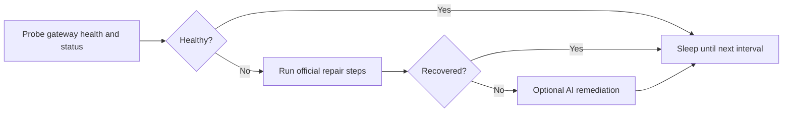

# fix-my-claw

[中文](README_ZH.md)

[](#requirements)
[](LICENSE)
[](CHANGELOG.md)

Keep OpenClaw healthy without babysitting it.

`fix-my-claw` is a small watchdog for long-running OpenClaw hosts. It probes gateway health and status, runs your official recovery steps, and stores a timestamped incident bundle for each failed repair. If you already recover OpenClaw with `openclaw doctor --repair --non-interactive` and `openclaw gateway restart`, `fix-my-claw` turns that playbook into a guarded loop with cooldowns, locking, and optional AI escalation.

[Features](#features) • [Installation](#installation) • [Quick Start](#quick-start) • [Configuration](#configuration) • [Systemd Deployment](#systemd-deployment) • [Docs](#documentation)



## Features

- OpenClaw-aware checks via `gateway health` and `gateway status`
- Official-first recovery with configurable `repair.official_steps`
- Incident bundles under `~/.fix-my-claw/attempts/<timestamp>/`
- Cooldowns, stale-lock cleanup, and single-instance protection
- AI-assisted remediation enabled in the default config
- Ready-to-use systemd units for long-running or timer-based deployment

## Installation

`fix-my-claw` is a Python CLI tool. The simplest install path is directly from GitHub:

```bash
python3 -m venv .venv
source .venv/bin/activate
pip install git+https://github.com/caopulan/fix-my-claw.git
```

If you already have the repo checked out locally:

```bash
pip install .
```

## Requirements

- Python 3.9+
- OpenClaw installed and callable as `openclaw`
- Access to the OpenClaw state and workspace directories on the target host
- Best deployed on the Gateway host itself; remote-only `gateway.mode=remote` setups need extra care because OpenClaw CLI probes may target a remote URL while local file repairs still touch the current machine

If `openclaw` is not on `PATH`, set `[openclaw].command` to an absolute path in the config file.

## Quick Start

Start the watchdog with default settings:

```bash
fix-my-claw up
```

That command will create a default config if needed, then start the monitor loop.

Default paths:

- Config: `~/.fix-my-claw/config.toml`
- Log file: `~/.fix-my-claw/fix-my-claw.log`
- Repair artifacts: `~/.fix-my-claw/attempts/<timestamp>/`

Useful one-shot commands:

```bash
# Write the default config and print its path
fix-my-claw init

# Probe once and print machine-readable JSON
fix-my-claw check --json

# Force one repair attempt, ignoring cooldown
fix-my-claw repair --force --json

# Run with a non-default config path
fix-my-claw monitor --config /etc/fix-my-claw/config.toml
```

## OpenClaw Integration

Out of the box, `fix-my-claw` uses the same OpenClaw commands an operator would run manually:

- Health probe: `openclaw gateway health --json`
- Status probe: `openclaw gateway status --json --require-rpc`
- Log capture: `openclaw logs --tail 200`
- Official repair steps:
  - `openclaw doctor --repair --non-interactive`
  - `openclaw gateway restart`

You can override the command path, probe arguments, and repair steps in the config.

## Configuration

All runtime settings live in one TOML file. Generate it with `fix-my-claw init`, or start from [examples/fix-my-claw.toml](examples/fix-my-claw.toml).

Key settings:

| Setting | What it controls |
| --- | --- |
| `[monitor].interval_seconds` | How often the watchdog probes OpenClaw |
| `[monitor].repair_cooldown_seconds` | Minimum delay between repair attempts |
| `[openclaw].command` | Absolute path to `openclaw` when `PATH` differs under systemd |
| `[openclaw].allow_remote_mode` | Allow running even when OpenClaw is configured with `gateway.mode=remote` |
| `[repair].official_steps` | The ordered recovery commands to run before AI escalation |
| `[ai].enabled` | Whether AI-assisted remediation is allowed |
| `[ai].backend` | `direct` or `acpx`; direct keeps native CLIs, acpx routes through the ACP client layer |
| `[ai].provider` | `auto`, `codex`, `claude`, or `openclaw`; the candidate order depends on the backend |
| `[ai].local` | When using `provider = "openclaw"`, bypass the Gateway with `openclaw agent --local` |
| `[ai].acpx_permissions` | Permission mode used for `acpx` runs, typically `approve-all` for unattended fixes |
| `[ai].allow_code_changes` | Whether a second-stage Codex run may make broader code or installation changes |

The default config stores all state under `~/.fix-my-claw`, so the tool remains self-contained and easy to inspect.

By default, `fix-my-claw` refuses to run if `openclaw config get gateway.mode --json` returns `"remote"`. This avoids the most dangerous mismatch: probing a remote Gateway while local repair steps still edit the current machine. Override that only with `[openclaw].allow_remote_mode = true`.

## Systemd Deployment

Linux deployment files live in [deploy/systemd](deploy/systemd):

- `fix-my-claw.service`: recommended long-running monitor loop
- `fix-my-claw-oneshot.service` + `fix-my-claw.timer`: periodic repair attempts

Example using the long-running service:

```bash
sudo mkdir -p /etc/fix-my-claw
sudo cp examples/fix-my-claw.toml /etc/fix-my-claw/config.toml

sudo cp deploy/systemd/fix-my-claw.service /etc/systemd/system/
sudo systemctl daemon-reload
sudo systemctl enable --now fix-my-claw.service
```

Notes for systemd hosts:

- The sample unit runs `/usr/bin/env fix-my-claw ...`. If you installed inside a virtualenv, replace `ExecStart` with the absolute path to that virtualenv's `fix-my-claw` binary.
- If `openclaw` is not found in the systemd environment, set `[openclaw].command` to an absolute path.

## AI-Assisted Remediation

AI-assisted remediation is enabled in the default config.

There are now 2 AI backends:

- `backend = "direct"`: current native integrations such as `codex exec` and `openclaw agent`
- `backend = "acpx"`: route supported coding agents through [`acpx`](https://github.com/openclaw/acpx), the ACP client/orchestrator layer

When `backend = "direct"` and `provider = "auto"`:

- `fix-my-claw` probes local `codex` and `openclaw` availability before AI fallback
- Current order is `codex` first, then `openclaw`
- `codex` is checked via CLI availability, while `openclaw` is checked via `openclaw models status --check --json`
- If the first provider is unusable or the repair run fails to recover OpenClaw, the next usable provider is tried automatically

When `backend = "acpx"` and `provider = "auto"`:

- `fix-my-claw` probes `codex` first, then `claude`
- `acpx openclaw` is supported, but it is intentionally not part of the default `auto` order because `openclaw acp` is backed by the Gateway
- This makes `acpx` a good unified interface for Codex/Claude-style coding agents, but not the right default path for Gateway-down OpenClaw recovery

When using the direct backend with `provider = "codex"`:

- The first stage runs `codex exec` in `workspace-write` mode with explicitly added directories
- The second stage is still disabled unless `ai.allow_code_changes = true`
- Daily attempt limits and cooldowns reduce the chance of repeated AI runs on the same host

When using the direct backend with `provider = "openclaw"`:

- `fix-my-claw` runs `openclaw agent`
- Set `local = true` to bypass the Gateway and use the embedded agent path directly
- This is the path to use when the Gateway is already down but the host still has working OpenClaw model/provider credentials
- If `provider` is explicitly pinned to `openclaw`, `codex` is still kept as the next provider-level fallback

When using the `acpx` backend:

- `fix-my-claw` runs one-shot `acpx <provider> exec --file -` calls
- The default `acpx` mode is non-interactive and auto-approved for unattended fixes
- `acpx` itself is still alpha, so pinning the binary/version is safer for production automation

Example:

```toml
[ai]
enabled = true
backend = "acpx"
provider = "auto"
acpx_command = "acpx"
acpx_permissions = "approve-all"
acpx_non_interactive_permissions = "fail"
acpx_format = "json"
timeout_seconds = 1800
```

If you want official repair steps only, set `[ai].enabled = false`.

## Trade-offs

- `fix-my-claw` automates recovery; it does not replace fixing the root cause in OpenClaw or the host
- If you only need a periodic check, the timer-based deployment may be a better fit than a full monitor loop
- The tool assumes it can read the relevant OpenClaw workspace and state directories
- Using OpenClaw-registered models during a Gateway outage is possible only through a local/embedded path such as `openclaw agent --local` or another direct provider path; the normal Gateway routing path is unavailable while the Gateway is down
- `acpx` is promising as a unified coding-agent interface, but it is still alpha and its `openclaw` target is Gateway-backed

## Documentation

- [Example config](examples/fix-my-claw.toml)
- [systemd deployment files](deploy/systemd)
- [Changelog](CHANGELOG.md)
- [Contributing guide](CONTRIBUTING.md)
- [Code of Conduct](CODE_OF_CONDUCT.md)
- [Security policy](SECURITY.md)
- [Issue tracker](https://github.com/caopulan/fix-my-claw/issues)

## Contributing

Contributions are welcome. Read [CONTRIBUTING.md](CONTRIBUTING.md) before opening a pull request.

For bug reports, include:

- Your OS and Python version
- Your OpenClaw version
- The relevant `fix-my-claw` config, with secrets redacted
- Recent logs from `~/.fix-my-claw/fix-my-claw.log`
- The latest attempt directory under `~/.fix-my-claw/attempts/`

## License

[MIT](LICENSE) © fix-my-claw contributors
