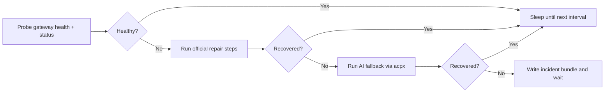

# fix-my-claw

[中文](README_ZH.md)

[](#requirements)
[](LICENSE)
[](CHANGELOG.md)
[](#how-it-works)

Keep OpenClaw healthy without babysitting it.

`fix-my-claw` is a watchdog and self-healing CLI for long-running OpenClaw hosts. It checks Gateway health, runs official recovery commands first, stores a timestamped incident bundle, and only escalates to AI when the standard playbook fails. The default AI path now uses `acpx` to try coding agents such as Codex and Claude without turning your README into a maze of manual recovery steps.

[Why](#why-fix-my-claw) • [Install](#install) • [Quick Start](#quick-start) • [How It Works](#how-it-works) • [Configuration](#configuration) • [Systemd](#systemd-deployment) • [Docs](#documentation)



<a id="why-fix-my-claw"></a>

## ✨ Why fix-my-claw

- 🩺 **OpenClaw-aware probes** with `gateway health` and `gateway status --require-rpc`
- 🛠️ **Official-first recovery** before any AI escalation
- 🤖 **AI fallback enabled by default** with `acpx` and automatic provider selection
- 🧷 **Safety guards** for cooldowns, stale locks, single-instance execution, and remote-mode mismatch
- 📦 **Incident bundles** under `~/.fix-my-claw/attempts/<timestamp>/` for every failed attempt
- 🖥️ **Deployable as a service** with ready-to-use `systemd` units and a timer

<a id="install"></a>

## 🚀 Install

`fix-my-claw` is a Python CLI tool. The fastest path is to install it from GitHub:

```bash
python3 -m venv .venv
source .venv/bin/activate
pip install git+https://github.com/caopulan/fix-my-claw.git
```

If you already have the repository:

```bash
pip install .
```

<a id="requirements"></a>

## 📋 Requirements

- Python 3.9+
- OpenClaw installed and callable as `openclaw`
- Access to the OpenClaw state and workspace directories on the target host
- `acpx` installed if you want to use the default AI backend as-is
- Best deployed on the Gateway host itself

If `openclaw` is not on `PATH`, set `[openclaw].command` to an absolute path in the config file.

<a id="quick-start"></a>

## ⚡ Quick Start

Start the watchdog with the default config:

```bash
fix-my-claw up
```

That command creates `~/.fix-my-claw/config.toml` if needed, then starts the monitor loop.

Common one-shot commands:

```bash
# Write the default config and print its path
fix-my-claw init

# Probe once and print machine-readable JSON
fix-my-claw check --json

# Dry-run every repair path, including AI backends and configured argv/path checks
fix-my-claw probe --json

# Skip live AI calls and only validate static prerequisites / dry-run syntax
fix-my-claw probe --no-live-ai --json

# Force one repair attempt, ignoring cooldown
fix-my-claw repair --force --json

# Run the monitor loop with a custom config path
fix-my-claw monitor --config /etc/fix-my-claw/config.toml
```

Default paths:

- Config: `~/.fix-my-claw/config.toml`
- Log file: `~/.fix-my-claw/fix-my-claw.log`
- Incident bundles: `~/.fix-my-claw/attempts/<timestamp>/`

Example console output:

```text
00:05:52 | START  | mode=up config=/Users/me/.fix-my-claw/config.toml
00:05:52 | WATCH  | watching every 60s log=/Users/me/.fix-my-claw/fix-my-claw.log
00:06:06 | PROBE  | status probe failed: rpc unavailable
00:06:08 | REPAIR | official 1/2 run=openclaw doctor --repair --non-interactive
00:06:32 | AI     | config stage backend=acpx providers=codex:ok, claude:ok
```

<a id="how-it-works"></a>

## 🧠 How It Works

`fix-my-claw` follows the same playbook a human operator would use, but wraps it with guards and repeatable automation:

1. Probe OpenClaw with:
   - `openclaw gateway health --json`
   - `openclaw gateway status --json --require-rpc`
2. If the Gateway is unhealthy, run official repair steps:
   - `openclaw doctor --repair --non-interactive`
   - `openclaw gateway restart`
3. If OpenClaw is still unhealthy, enter AI fallback.
4. Write the full attempt context, command outputs, and logs to an incident bundle.

Default AI fallback behavior:

- `ai.enabled = true`
- `ai.backend = "acpx"`
- `ai.provider = "auto"`
- automatic order: `codex`, then `claude`

`acpx openclaw` is supported when explicitly selected, but it is not part of the default `auto` order because it depends on the Gateway-backed `openclaw acp` path.

`fix-my-claw probe` goes a step further than `check`: it validates the configured repair methods, dry-runs official repair commands with `--help`, checks whether the configured argv references real paths, and can perform live AI dry-runs to verify that auth is actually usable instead of merely installed.

## 🔌 OpenClaw and AI Integration

### OpenClaw commands used out of the box

- Health probe: `openclaw gateway health --json`
- Status probe: `openclaw gateway status --json --require-rpc`
- Log capture: `openclaw logs --tail 200`
- Official repair steps:
  - `openclaw doctor --repair --non-interactive`
  - `openclaw gateway restart`

### AI backends

- `backend = "acpx"`: default unified interface for supported coding agents
- `backend = "direct"`: native integrations such as `codex exec` and `openclaw agent`

When `backend = "acpx"` and `provider = "auto"`:

- `fix-my-claw` probes `acpx`, then checks whether `codex` and `claude` are callable
- the first usable provider is tried first
- if it does not restore health, the next usable provider is tried automatically
- AI runs are one-shot `acpx <provider> exec --file -` commands with stdin prompts

When `backend = "direct"` and `provider = "auto"`:

- the order is `codex`, then `openclaw`
- `openclaw` availability is checked with `openclaw models status --check --json`
- `provider = "openclaw"` can use `openclaw agent --local` to bypass the Gateway

Second-stage AI remediation is still opt-in:

- set `ai.allow_code_changes = true` to let the AI move from config/state repair to broader code or installation changes

<a id="configuration"></a>

## ⚙️ Configuration

All runtime settings live in one TOML file. Generate it with `fix-my-claw init`, or start from [examples/fix-my-claw.toml](examples/fix-my-claw.toml).

Key settings:

| Setting | What it controls |
| --- | --- |
| `[monitor].interval_seconds` | How often the watchdog probes OpenClaw |
| `[monitor].repair_cooldown_seconds` | Minimum delay between repair attempts |
| `[openclaw].command` | Absolute path to `openclaw` when `PATH` differs under systemd |
| `[openclaw].allow_remote_mode` | Allow running even when OpenClaw is configured with `gateway.mode=remote` |
| `[repair].official_steps` | Ordered recovery commands to run before AI escalation |
| `[ai].enabled` | Whether AI-assisted remediation is allowed |
| `[ai].backend` | `acpx` or `direct` |
| `[ai].provider` | `auto`, `codex`, `claude`, or `openclaw` |
| `[ai].local` | When using `provider = "openclaw"`, bypass the Gateway with `openclaw agent --local` |
| `[ai].acpx_permissions` | Permission mode for unattended `acpx` runs |
| `[ai].allow_code_changes` | Whether a second AI stage may make broader code changes |

Safety defaults worth knowing:

- `fix-my-claw` refuses to run by default when `gateway.mode=remote`
- AI runs are rate-limited by per-day limits and cooldowns
- the default config keeps all state under `~/.fix-my-claw`

Example AI config:

```toml
[ai]
enabled = true
backend = "acpx"
provider = "auto"
acpx_command = "acpx"
acpx_permissions = "approve-all"
acpx_non_interactive_permissions = "fail"
acpx_format = "json"
timeout_seconds = 1800
```

<a id="systemd-deployment"></a>

## 🖥️ Systemd Deployment

Linux deployment files live in [deploy/systemd](deploy/systemd):

- `fix-my-claw.service`: long-running monitor loop
- `fix-my-claw-oneshot.service` + `fix-my-claw.timer`: periodic repair attempts

Example:

```bash
sudo mkdir -p /etc/fix-my-claw
sudo cp examples/fix-my-claw.toml /etc/fix-my-claw/config.toml

sudo cp deploy/systemd/fix-my-claw.service /etc/systemd/system/
sudo systemctl daemon-reload
sudo systemctl enable --now fix-my-claw.service
```

Notes:

- If you installed inside a virtualenv, replace `ExecStart` with the absolute path to that virtualenv's `fix-my-claw` binary.
- If `openclaw` is not visible inside the `systemd` environment, set `[openclaw].command` to an absolute path.

## ⚠️ Trade-offs and Boundaries

- `fix-my-claw` automates recovery; it does not remove the need to fix root causes
- `acpx` is a strong default interface for Codex/Claude-style remediation, but it is still alpha
- `acpx openclaw` depends on the Gateway, so it is not the default AI fallback path for a dead Gateway
- Using OpenClaw-registered models during a Gateway outage requires a local or embedded path such as `openclaw agent --local`
- If you only need periodic checks, the timer-based deployment may be a better fit than a full monitor loop

<a id="documentation"></a>

## 📚 Documentation

- [Example config](examples/fix-my-claw.toml)
- [systemd deployment files](deploy/systemd)
- [Changelog](CHANGELOG.md)
- [Contributing guide](CONTRIBUTING.md)
- [Code of Conduct](CODE_OF_CONDUCT.md)
- [Security policy](SECURITY.md)
- [Issue tracker](https://github.com/caopulan/fix-my-claw/issues)

## 🤝 Contributing

Contributions are welcome. Read [CONTRIBUTING.md](CONTRIBUTING.md) before opening a pull request.

Bug reports are much easier to triage when they include:

- OS and Python version
- OpenClaw version
- relevant `fix-my-claw` config with secrets redacted
- recent `~/.fix-my-claw/fix-my-claw.log`
- the latest attempt directory under `~/.fix-my-claw/attempts/`

## 📄 License

[MIT](LICENSE) © fix-my-claw contributors
