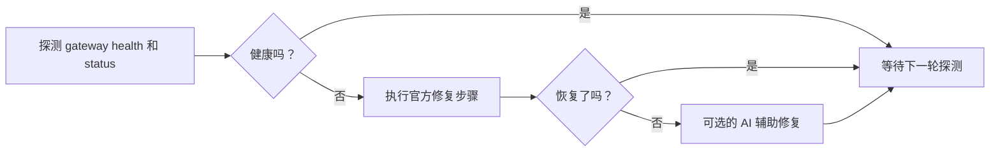

# fix-my-claw

[English](README.md)

[](#环境要求)
[](LICENSE)
[](CHANGELOG.md)

让 OpenClaw 在无人值守时也能保持健康。

`fix-my-claw` 是一个面向 OpenClaw 主机的小型守护与自愈工具。它会探测 gateway 的健康状态，按你定义的官方修复步骤执行恢复，并为每次失败修复保留一个带时间戳的现场目录。如果你现在已经在手工执行 `openclaw doctor --repair --non-interactive` 和 `openclaw gateway restart`，`fix-my-claw` 会把这套流程变成带冷却、锁和可选 AI 升级修复的守护循环。

[功能](#功能) • [安装](#安装) • [快速开始](#快速开始) • [配置](#配置) • [Systemd 部署](#systemd-部署) • [文档](#文档)



## 功能

- 直接面向 OpenClaw 的 `gateway health` 和 `gateway status` 探测
- 先走官方修复步骤，再决定是否升级到 AI 修复
- 每次修复都在 `~/.fix-my-claw/attempts/<timestamp>/` 下保留现场
- 内置冷却、过期锁清理和单实例保护，避免抖动
- 默认配置已开启 AI 辅助修复
- 自带 systemd 服务与定时器部署文件

## 安装

`fix-my-claw` 是一个 Python CLI 工具。最直接的安装方式是从 GitHub 安装：

```bash
python3 -m venv .venv
source .venv/bin/activate
pip install git+https://github.com/caopulan/fix-my-claw.git
```

如果你已经把仓库拉到本地：

```bash
pip install .
```

## 环境要求

- Python 3.9+
- 已安装 OpenClaw，且可以通过 `openclaw` 调用
- 运行机器能访问 OpenClaw 的 state 目录和 workspace 目录
- 最好直接部署在 Gateway 所在主机上；如果你的 OpenClaw 使用 `gateway.mode=remote`，CLI 探测目标可能是远端，但本地文件修复仍发生在当前机器，需要额外确认

如果 `openclaw` 不在 `PATH` 中，请在配置里把 `[openclaw].command` 改成绝对路径。

## 快速开始

用默认设置启动守护：

```bash
fix-my-claw up
```

这个命令会在缺少配置时自动生成默认配置，然后启动常驻监控循环。

默认路径：

- 配置文件：`~/.fix-my-claw/config.toml`
- 日志文件：`~/.fix-my-claw/fix-my-claw.log`
- 修复现场：`~/.fix-my-claw/attempts/<timestamp>/`

常用单次命令：

```bash
# 生成默认配置并打印路径
fix-my-claw init

# 单次探测，并输出机器可读 JSON
fix-my-claw check --json

# 忽略冷却限制，强制执行一次修复
fix-my-claw repair --force --json

# 使用自定义配置文件运行
fix-my-claw monitor --config /etc/fix-my-claw/config.toml
```

## 与 OpenClaw 的集成方式

默认情况下，`fix-my-claw` 使用的就是运维人员平时手工执行的 OpenClaw 命令：

- 健康探测：`openclaw gateway health --json`
- 状态探测：`openclaw gateway status --json --require-rpc`
- 日志抓取：`openclaw logs --tail 200`
- 官方修复步骤：
  - `openclaw doctor --repair --non-interactive`
  - `openclaw gateway restart`

这些命令路径、探测参数和修复步骤都可以在配置文件里覆盖。

## 配置

所有运行时设置都集中在一个 TOML 文件里。你可以先执行 `fix-my-claw init` 生成默认配置，或者直接参考 [examples/fix-my-claw.toml](examples/fix-my-claw.toml)。

关键配置项：

| 配置项 | 作用 |
| --- | --- |
| `[monitor].interval_seconds` | 守护循环的探测间隔 |
| `[monitor].repair_cooldown_seconds` | 两次修复之间的最小间隔 |
| `[openclaw].command` | systemd 环境下 `PATH` 不一致时指定 `openclaw` 绝对路径 |
| `[openclaw].allow_remote_mode` | 是否允许在 `gateway.mode=remote` 时继续运行 |
| `[repair].official_steps` | 进入 AI 修复前的官方修复命令序列 |
| `[ai].enabled` | 是否允许 AI 辅助修复 |
| `[ai].backend` | `direct` 或 `acpx`；前者走原生 CLI，后者走 ACP 客户端接口层 |
| `[ai].provider` | `auto`、`codex`、`claude` 或 `openclaw`；自动顺序取决于 backend |
| `[ai].local` | 当 `provider = "openclaw"` 时，是否使用 `openclaw agent --local` 直接绕过 Gateway |
| `[ai].acpx_permissions` | `acpx` 运行时使用的权限模式；无人值守修复通常需要 `approve-all` |
| `[ai].allow_code_changes` | 是否允许第二阶段进行更宽松的代码或安装修改 |

默认配置会把状态、日志和修复现场都放在 `~/.fix-my-claw` 下，便于排查和清理。

默认情况下，只要 `openclaw config get gateway.mode --json` 返回 `"remote"`，`fix-my-claw` 就会拒绝运行。这样可以避免最危险的错配场景：探测的是远端 Gateway，但本地修复步骤改的却是当前机器。只有在你明确知道自己在做什么时，才应手动设置 `[openclaw].allow_remote_mode = true`。

## Systemd 部署

Linux 部署文件位于 [deploy/systemd](deploy/systemd)：

- `fix-my-claw.service`：推荐，常驻监控循环
- `fix-my-claw-oneshot.service` + `fix-my-claw.timer`：按周期执行修复

使用常驻服务的示例：

```bash
sudo mkdir -p /etc/fix-my-claw
sudo cp examples/fix-my-claw.toml /etc/fix-my-claw/config.toml

sudo cp deploy/systemd/fix-my-claw.service /etc/systemd/system/
sudo systemctl daemon-reload
sudo systemctl enable --now fix-my-claw.service
```

systemd 主机上的注意事项：

- 示例 unit 使用的是 `/usr/bin/env fix-my-claw ...`。如果你把它装在虚拟环境里，请把 `ExecStart` 改成虚拟环境里 `fix-my-claw` 的绝对路径。
- 如果 systemd 环境里找不到 `openclaw`，请把 `[openclaw].command` 配成绝对路径。

## AI 辅助修复

默认配置已开启 AI 辅助修复。

现在有两条 AI backend：

- `backend = "acpx"`：默认统一走 [`acpx`](https://github.com/openclaw/acpx) 这层 ACP 客户端/调度接口
- `backend = "direct"`：可选的原生集成路径，例如 `codex exec` 和 `openclaw agent`

默认配置下，AI 兜底会以这组设置运行：

- `backend = "acpx"`
- `provider = "auto"`
- 当前自动顺序是：`codex`，然后 `claude`
- `acpx openclaw` 依然支持，但不会进入默认 `auto` 顺序，因为它底层依赖 Gateway-backed 的 `openclaw acp`

当 `backend = "direct"` 且 `provider = "auto"` 时：

- `fix-my-claw` 会先本地探测 `codex` 和 `openclaw` 这两条 AI 修复路径是否可用
- 当前顺序是先 `codex`，再 `openclaw`
- `codex` 通过 CLI 可执行性做快速检查，`openclaw` 通过 `openclaw models status --check --json` 做本地可用性检查
- 如果前一个 provider 不可用，或执行后仍未修好，就会自动尝试下一个可用 provider

当 `backend = "acpx"` 且 `provider = "auto"` 时：

- `fix-my-claw` 会先探测 `codex`，再探测 `claude`
- `acpx openclaw` 虽然支持，但不会被放进默认 `auto` 顺序，因为它底层依赖 `openclaw acp`，而后者是 Gateway-backed
- 所以 `acpx` 现在就是 Codex/Claude 这类 coding agent 的默认统一接口层，但不是 Gateway 宕机时 OpenClaw 模型修复的默认路径

当使用 direct backend 且 `provider = "codex"` 时：

- 第一阶段会以 `workspace-write` 模式运行 `codex exec`，并只附加明确允许的目录
- 第二阶段依旧默认关闭，只有 `ai.allow_code_changes = true` 才会放开
- 每日次数限制和冷却时间会降低同一主机反复触发 AI 修复的概率

当使用 direct backend 且 `provider = "openclaw"` 时：

- `fix-my-claw` 会执行 `openclaw agent`
- 如果 Gateway 本身已经不健康，建议把 `local = true` 打开，直接走嵌入式 agent 路径
- 这也是“Gateway 已宕机，但仍希望借 OpenClaw 已注册模型继续修复”的主要方式
- 如果你显式固定 `provider = "openclaw"`，`codex` 仍会作为下一层 provider 级兜底

当使用 `acpx` backend 时：

- `fix-my-claw` 会执行 one-shot 的 `acpx <provider> exec --file -`
- 默认 `acpx` 配置适合无人值守修复，会自动批准运行所需权限
- 但 `acpx` 本身仍处于 alpha，生产环境更适合固定版本，而不是盲跟最新

示例：

```toml
[ai]
enabled = true
backend = "acpx"
provider = "auto"
acpx_command = "acpx"
acpx_permissions = "approve-all"
acpx_non_interactive_permissions = "fail"
acpx_format = "json"
timeout_seconds = 1800
```

如果你只想保留官方修复步骤，可以把 `[ai].enabled = false`。

## 取舍与边界

- `fix-my-claw` 负责自动恢复，不替代你去修掉 OpenClaw 或宿主机上的根因问题
- 如果你只需要定时检查，timer 方式可能比常驻监控更合适
- 工具默认假设自己能读取 OpenClaw 的 workspace 和 state 目录
- 如果 Gateway 已宕机，仍想使用 OpenClaw 已注册模型，必须走本地/嵌入式执行路径，例如 `openclaw agent --local`，或者直接走 provider 直连；常规 Gateway 路由在 Gateway 宕机时不可用
- `acpx` 很适合作为统一 coding-agent interface，但它仍是 alpha，且它的 `openclaw` target 依赖 Gateway

## 文档

- [示例配置](examples/fix-my-claw.toml)
- [systemd 部署文件](deploy/systemd)
- [更新日志](CHANGELOG.md)
- [贡献指南](CONTRIBUTING.md)
- [行为准则](CODE_OF_CONDUCT.md)
- [安全策略](SECURITY.md)
- [Issue 列表](https://github.com/caopulan/fix-my-claw/issues)

## 参与贡献

欢迎提交贡献。发起 PR 前先看 [CONTRIBUTING.md](CONTRIBUTING.md)。

提交 bug 时，建议附带：

- 你的操作系统和 Python 版本
- 你的 OpenClaw 版本
- 相关的 `fix-my-claw` 配置，敏感信息请先脱敏
- 最近的 `~/.fix-my-claw/fix-my-claw.log`
- 最新一次 `~/.fix-my-claw/attempts/` 下的现场目录

## 开源协议

[MIT](LICENSE) © fix-my-claw contributors
