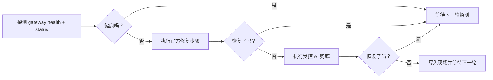

# fix-my-claw

[English](README.md)

[](#requirements-zh)
[](LICENSE)
[](CHANGELOG.md)
[](#how-it-works-zh)

让 OpenClaw 在无人值守时也能保持健康。

`fix-my-claw` 是一个面向 OpenClaw 主机的 self-healing watchdog。它会持续探测 Gateway 健康状态，优先执行官方修复步骤，为每次修复保留带时间戳的现场目录，并且只在标准流程失败后才升级到 AI 修复。

当前默认 AI 路径已经切到 `acpx`，所以它不仅能“看到命令装没装”，还可以把 Codex、Claude 这类 coding agent 纳入受控的修复链路。

[亮点](#highlights-zh) • [安装](#install-zh) • [命令](#commands-zh) • [快速开始](#quick-start-zh) • [工作方式](#how-it-works-zh) • [Probe 模式](#probe-mode-zh) • [配置](#configuration-zh) • [Systemd 部署](#systemd-deployment-zh) • [文档](#documentation-zh)



<a id="highlights-zh"></a>

## ✨ 亮点

- 🩺 **懂 OpenClaw 的探测**，直接使用 `gateway health` 和 `gateway status --require-rpc`
- 🛠️ **官方修复优先**，不会一上来就把问题丢给 AI
- 🤖 **默认带 AI 兜底**，通过 `acpx` 自动尝试可用的 coding agent
- 🔍 **真正的能力探测**，`fix-my-claw probe` 会检查 auth、参数、路径和 dry-run 可行性
- 📦 **每次修复都留痕**，现场目录默认写到 `~/.fix-my-claw/attempts/<timestamp>/`
- 🧷 **运维保护齐全**，包含冷却、锁、单实例与 remote-mode 安全保护
- 🖥️ **适合长期部署**，仓库自带 `systemd` service 和 timer

## 🎯 它解决什么问题

如果你现在平时是靠下面这些命令手工修 OpenClaw：

- `openclaw doctor --repair --non-interactive`
- `openclaw gateway restart`

那 `fix-my-claw` 做的就是把这份 runbook 变成一个稳定的自动流程：

- 先检查 OpenClaw 是否健康
- 再跑和人工一样的官方修复步骤
- 自动记录发生了什么
- 只有标准流程没修好，才进入 AI 兜底

<a id="commands-zh"></a>

## 🧰 命令总览

| 命令 | 作用 | 典型场景 |
| --- | --- | --- |
| `fix-my-claw up` | 自动初始化默认配置并启动监控 | 一键启动 |
| `fix-my-claw monitor` | 进入常驻监控循环 | systemd / 后台守护 |
| `fix-my-claw check` | 只做一次健康探测 | 健康检查 / 脚本 |
| `fix-my-claw probe` | 校验修复路径、参数、路径和 AI 能力 | 上线前检查 / 排障 |
| `fix-my-claw repair` | 立即执行一次修复 | 手动干预 |
| `fix-my-claw init` | 写入默认配置 | 首次安装 |

<a id="install-zh"></a>

## 🚀 安装

最直接的安装方式是从 GitHub 安装：

```bash
python3 -m venv .venv
source .venv/bin/activate
pip install git+https://github.com/caopulan/fix-my-claw.git
```

如果你已经把仓库拉到本地：

```bash
pip install .
```

<a id="requirements-zh"></a>

## 📋 环境要求

- Python 3.9+
- 已安装 OpenClaw，且可以通过 `openclaw` 调用
- 目标机器能访问 OpenClaw 的 workspace 和 state 目录
- 如果你想直接使用默认 AI backend，需要本机已安装 `acpx`
- 最好直接部署在 Gateway 所在主机

如果 `openclaw` 不在 `PATH` 中，请在配置里把 `[openclaw].command` 改成绝对路径。

<a id="quick-start-zh"></a>

## ⚡ 快速开始

用默认配置启动守护：

```bash
fix-my-claw up
```

这个命令会在缺少 `~/.fix-my-claw/config.toml` 时自动生成默认配置，然后进入常驻监控循环。

常用单次命令：

```bash
# 生成默认配置并打印路径
fix-my-claw init

# 单次健康探测
fix-my-claw check --json

# 对修复路径做完整 dry-run / preflight 检查
fix-my-claw probe --json

# 跳过 live AI 调用，只做静态检查
fix-my-claw probe --no-live-ai --json

# 立即强制执行一次修复
fix-my-claw repair --force --json
```

默认路径：

- 配置文件：`~/.fix-my-claw/config.toml`
- 日志文件：`~/.fix-my-claw/fix-my-claw.log`
- 修复现场：`~/.fix-my-claw/attempts/<timestamp>/`

终端日志示例：

```text
00:05:52 | START  | mode=up config=/Users/me/.fix-my-claw/config.toml
00:05:52 | WATCH  | watching every 60s log=/Users/me/.fix-my-claw/fix-my-claw.log
00:06:06 | PROBE  | status probe failed: rpc unavailable
00:06:08 | REPAIR | official 1/2 run=openclaw doctor --repair --non-interactive
00:06:32 | AI     | config stage backend=acpx providers=codex:ok, claude:ok
```

<a id="how-it-works-zh"></a>

## 🧠 工作方式

默认执行链路是这样的：

1. 探测 OpenClaw：
   - `openclaw gateway health --json`
   - `openclaw gateway status --json --require-rpc`
2. 如果健康，就什么都不做，等待下一轮。
3. 如果不健康，先执行官方修复步骤：
   - `openclaw doctor --repair --non-interactive`
   - `openclaw gateway restart`
4. 每跑完一步都重新检查健康状态。
5. 如果还没恢复，再进入 AI 兜底。
6. 全过程把日志、命令输出和上下文写进现场目录。

默认 AI 行为：

- `ai.enabled = true`
- `ai.backend = "acpx"`
- `ai.provider = "auto"`
- 自动顺序：`codex`，然后 `claude`
- `ai.allow_code_changes = false`

也就是说，默认只会做受控的配置/状态级 AI 修复，不会直接放开大范围代码修改。

## 🔌 OpenClaw 集成

默认会使用这些 OpenClaw 命令：

- 健康探测：`openclaw gateway health --json`
- 状态探测：`openclaw gateway status --json --require-rpc`
- 日志抓取：`openclaw logs --tail 200`
- 官方修复：
  - `openclaw doctor --repair --non-interactive`
  - `openclaw gateway restart`

这些命令都可以在配置里覆盖。

## 🤖 AI Backend

现在有两条 AI backend：

- `backend = "acpx"`：默认的统一 coding-agent 接口层
- `backend = "direct"`：原生 CLI 路径，例如 `codex exec` 和 `openclaw agent`

当 `backend = "acpx"` 且 `provider = "auto"` 时：

- `fix-my-claw` 会先探测 `acpx`
- 再检查 `codex`、`claude` 是否真的可调用
- 先尝试第一个可用 provider
- 如果没修好，再自动尝试下一个可用 provider

当 `backend = "direct"` 且 `provider = "auto"` 时：

- 顺序是 `codex`，然后 `openclaw`
- `openclaw` 的本地可用性通过 `openclaw models status --check --json` 检查
- `provider = "openclaw"` 时可以用 `openclaw agent --local` 直接绕过 Gateway

一个重要边界：

- `acpx openclaw` 虽然支持
- 但它不会进入默认 `auto` 顺序，因为它依赖 Gateway-backed 的 `openclaw acp`

<a id="probe-mode-zh"></a>

## 🔍 Probe 模式

`fix-my-claw probe` 是这个项目的 preflight / capability check 命令。

它比 `check` 更进一步：

- 检查 `gateway.mode` 是否安全
- 检查配置里的目录是否存在或可创建
- 用 `--help` 对官方修复命令做 dry-run
- 检查当前 argv 里引用的路径是否真实存在
- 检查 AI backend / provider 是否可用
- 可选地做 live AI dry-run，确认 auth 和执行链路真的通，而不是“只是命令装了”

示例：

```bash
fix-my-claw probe --json
```

轻量模式：

```bash
fix-my-claw probe --no-live-ai --json
```

典型输出：

```text
probe summary: 8 ok, 2 warn, 3 fail, 0 skip
[OK  ] config.gateway_mode: gateway.mode=local
[OK  ] repair.official.1: dry-run syntax check passed
[FAIL] ai.acpx.codex: static probe failed: acpx-command-unavailable
```

它适合回答这些问题：

- “Codex 只是装了，还是已经真的能用？”
- “auth 到底配通了没有？”
- “我当前配置里的参数会不会因为路径不存在直接失败？”
- “默认 AI backend 在这台机器上到底能不能跑？”

<a id="configuration-zh"></a>

## ⚙️ 配置

所有运行时设置都集中在一个 TOML 文件里。你可以先执行 `fix-my-claw init` 生成默认配置，或者直接参考 [examples/fix-my-claw.toml](examples/fix-my-claw.toml)。

关键配置项：

| 配置项 | 作用 |
| --- | --- |
| `[monitor].interval_seconds` | 守护循环的探测间隔 |
| `[monitor].repair_cooldown_seconds` | 两次修复之间的最小间隔 |
| `[openclaw].command` | systemd 环境下指定 `openclaw` 绝对路径 |
| `[openclaw].allow_remote_mode` | 是否允许在 `gateway.mode=remote` 时继续运行 |
| `[repair].official_steps` | AI 之前要跑的官方修复命令序列 |
| `[ai].enabled` | 是否允许 AI 修复 |
| `[ai].backend` | `acpx` 或 `direct` |
| `[ai].provider` | `auto`、`codex`、`claude` 或 `openclaw` |
| `[ai].local` | 当 `provider = "openclaw"` 时，是否使用 `openclaw agent --local` |
| `[ai].acpx_permissions` | 无人值守 `acpx` 的权限模式 |
| `[ai].allow_code_changes` | 是否允许第二阶段做代码修改 |

几个重要默认值：

- 默认拒绝在 `gateway.mode=remote` 下运行
- AI 有冷却时间和每日次数限制
- 所有状态文件默认都落在 `~/.fix-my-claw`

AI 配置示例：

```toml
[ai]
enabled = true
backend = "acpx"
provider = "auto"
acpx_command = "acpx"
acpx_permissions = "approve-all"
acpx_non_interactive_permissions = "fail"
acpx_format = "json"
timeout_seconds = 1800
allow_code_changes = false
```

<a id="systemd-deployment-zh"></a>

## 🖥️ Systemd 部署

Linux 部署文件位于 [deploy/systemd](deploy/systemd)：

- `fix-my-claw.service`：常驻监控循环
- `fix-my-claw-oneshot.service` + `fix-my-claw.timer`：按周期执行修复

示例：

```bash
sudo mkdir -p /etc/fix-my-claw
sudo cp examples/fix-my-claw.toml /etc/fix-my-claw/config.toml

sudo cp deploy/systemd/fix-my-claw.service /etc/systemd/system/
sudo systemctl daemon-reload
sudo systemctl enable --now fix-my-claw.service
```

注意：

- 如果你装在虚拟环境里，请把 `ExecStart` 改成虚拟环境中 `fix-my-claw` 的绝对路径。
- 如果 `systemd` 环境里看不到 `openclaw`，请把 `[openclaw].command` 配成绝对路径。

## ⚠️ 取舍与边界

- `fix-my-claw` 负责自动恢复，不替代你去修掉根因
- `acpx` 很适合作为 Codex/Claude 风格修复的默认接口，但它本身仍处于 alpha
- `acpx openclaw` 依赖 Gateway，所以它不是“Gateway 挂了以后”的默认 AI 兜底路径
- 如果想在 Gateway 宕机时继续使用 OpenClaw 已注册模型，需要走本地或嵌入式路径，例如 `openclaw agent --local`
- 如果你只需要定时检查，timer 方式可能比常驻监控更合适

<a id="documentation-zh"></a>

## 📚 文档

- [示例配置](examples/fix-my-claw.toml)
- [systemd 部署文件](deploy/systemd)
- [更新日志](CHANGELOG.md)
- [贡献指南](CONTRIBUTING.md)
- [行为准则](CODE_OF_CONDUCT.md)
- [安全策略](SECURITY.md)
- [Issue 列表](https://github.com/caopulan/fix-my-claw/issues)

## 🤝 参与贡献

欢迎提交贡献。发起 PR 前先看 [CONTRIBUTING.md](CONTRIBUTING.md)。

提交 bug 时，建议附带：

- 你的操作系统和 Python 版本
- 你的 OpenClaw 版本
- 相关的 `fix-my-claw` 配置，敏感信息请先脱敏
- 最近的 `~/.fix-my-claw/fix-my-claw.log`
- 最新一次 `~/.fix-my-claw/attempts/` 下的现场目录

## 📄 开源协议

[MIT](LICENSE) © fix-my-claw contributors
