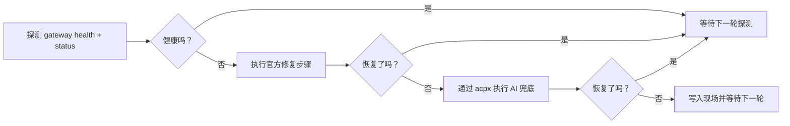

# fix-my-claw

[English](README.md)

[](#requirements-zh)
[](LICENSE)
[](CHANGELOG.md)
[](#how-it-works-zh)

让 OpenClaw 在无人值守时也能保持健康。

`fix-my-claw` 是一个面向 OpenClaw 主机的 watchdog + self-healing CLI。它会持续检查 Gateway 健康状态，优先执行官方修复命令，为每次修复保留带时间戳的现场目录，并且只在标准流程失败后才升级到 AI 修复。当前默认 AI 路径已经切到 `acpx`，会自动尝试 Codex 和 Claude，而不是要求你手工盯着恢复流程。

[为什么需要它](#why-fix-my-claw-zh) • [安装](#install-zh) • [快速开始](#quick-start-zh) • [工作方式](#how-it-works-zh) • [配置](#configuration-zh) • [Systemd 部署](#systemd-deployment-zh) • [文档](#documentation-zh)



<a id="why-fix-my-claw-zh"></a>

## ✨ 为什么需要 fix-my-claw

- 🩺 **懂 OpenClaw 的探测**，直接检查 `gateway health` 和 `gateway status --require-rpc`
- 🛠️ **官方修复优先**，不会一上来就把问题丢给 AI
- 🤖 **默认带 AI 兜底**，通过 `acpx` 自动尝试可用的 coding agent
- 🧷 **安全保护完整**，包含冷却、锁、单实例与 remote-mode 防误修
- 📦 **每次修复都留痕**，现场目录默认写到 `~/.fix-my-claw/attempts/<timestamp>/`
- 🖥️ **适合长期部署**，仓库自带 `systemd` service 和 timer

<a id="install-zh"></a>

## 🚀 安装

`fix-my-claw` 是一个 Python CLI 工具。最快的安装方式是直接从 GitHub 安装：

```bash
python3 -m venv .venv
source .venv/bin/activate
pip install git+https://github.com/caopulan/fix-my-claw.git
```

如果你已经把仓库拉到本地：

```bash
pip install .
```

<a id="requirements-zh"></a>

## 📋 环境要求

- Python 3.9+
- 已安装 OpenClaw，且可以通过 `openclaw` 调用
- 目标机器能访问 OpenClaw 的 state 目录和 workspace 目录
- 如果你要直接使用默认 AI backend，需要本机已安装 `acpx`
- 最好直接部署在 Gateway 所在主机

如果 `openclaw` 不在 `PATH` 中，请在配置里把 `[openclaw].command` 改成绝对路径。

<a id="quick-start-zh"></a>

## ⚡ 快速开始

用默认配置启动守护：

```bash
fix-my-claw up
```

这个命令会在缺少 `~/.fix-my-claw/config.toml` 时自动生成默认配置，然后启动常驻监控循环。

常用单次命令：

```bash
# 生成默认配置并打印路径
fix-my-claw init

# 单次探测，并输出机器可读 JSON
fix-my-claw check --json

# 对每种修复路径做 dry-run，包括 AI backend、配置参数和路径检查
fix-my-claw probe --json

# 跳过 live AI 调用，只检查静态前置条件和 dry-run 语法
fix-my-claw probe --no-live-ai --json

# 忽略冷却限制，强制执行一次修复
fix-my-claw repair --force --json

# 使用自定义配置文件运行监控循环
fix-my-claw monitor --config /etc/fix-my-claw/config.toml
```

默认路径：

- 配置文件：`~/.fix-my-claw/config.toml`
- 日志文件：`~/.fix-my-claw/fix-my-claw.log`
- 修复现场：`~/.fix-my-claw/attempts/<timestamp>/`

终端日志示例：

```text
00:05:52 | START  | mode=up config=/Users/me/.fix-my-claw/config.toml
00:05:52 | WATCH  | watching every 60s log=/Users/me/.fix-my-claw/fix-my-claw.log
00:06:06 | PROBE  | status probe failed: rpc unavailable
00:06:08 | REPAIR | official 1/2 run=openclaw doctor --repair --non-interactive
00:06:32 | AI     | config stage backend=acpx providers=codex:ok, claude:ok
```

<a id="how-it-works-zh"></a>

## 🧠 工作方式

`fix-my-claw` 做的其实就是把人工运维的恢复手册包装成一个带保护的自动循环：

1. 用下面两个命令探测 OpenClaw：
   - `openclaw gateway health --json`
   - `openclaw gateway status --json --require-rpc`
2. 如果 Gateway 不健康，先执行官方修复步骤：
   - `openclaw doctor --repair --non-interactive`
   - `openclaw gateway restart`
3. 如果还没恢复，再进入 AI 兜底。
4. 每一轮修复都会把上下文、命令输出和日志写进现场目录。

默认 AI 兜底设置是：

- `ai.enabled = true`
- `ai.backend = "acpx"`
- `ai.provider = "auto"`
- 自动顺序：`codex`，然后 `claude`

`acpx openclaw` 依然支持，但不会被放进默认 `auto` 顺序，因为它底层依赖 Gateway-backed 的 `openclaw acp`。

`fix-my-claw probe` 比 `check` 更进一步：它会校验配置里的修复路径，用 `--help` 对官方修复命令做 dry-run，检查当前 argv 里引用的路径是否真实存在，并且可以做 live AI dry-run，确认你不是“只装了命令”，而是真的把 auth 和执行链路都配通了。

## 🔌 OpenClaw 与 AI 集成

### 默认使用的 OpenClaw 命令

- 健康探测：`openclaw gateway health --json`
- 状态探测：`openclaw gateway status --json --require-rpc`
- 日志抓取：`openclaw logs --tail 200`
- 官方修复步骤：
  - `openclaw doctor --repair --non-interactive`
  - `openclaw gateway restart`

### AI backend

- `backend = "acpx"`：默认的统一 coding-agent 接口层
- `backend = "direct"`：原生 CLI 路径，例如 `codex exec` 和 `openclaw agent`

当 `backend = "acpx"` 且 `provider = "auto"` 时：

- `fix-my-claw` 会先检查 `acpx` 本身是否可用，再探测 `codex` 和 `claude`
- 先尝试第一个可用 provider
- 如果没有修好，会自动尝试下一个可用 provider
- 实际执行的是 one-shot `acpx <provider> exec --file -`

当 `backend = "direct"` 且 `provider = "auto"` 时：

- 顺序是 `codex`，然后 `openclaw`
- `openclaw` 的本地可用性通过 `openclaw models status --check --json` 检查
- `provider = "openclaw"` 时可以用 `openclaw agent --local` 直接绕过 Gateway

第二阶段 AI 修复依然是显式开关：

- 只有设置 `ai.allow_code_changes = true`，AI 才会从“配置/状态修复”升级到更宽的代码或安装修改

<a id="configuration-zh"></a>

## ⚙️ 配置

所有运行时设置都集中在一个 TOML 文件里。你可以先执行 `fix-my-claw init` 生成默认配置，或者直接参考 [examples/fix-my-claw.toml](examples/fix-my-claw.toml)。

关键配置项：

| 配置项 | 作用 |
| --- | --- |
| `[monitor].interval_seconds` | 守护循环的探测间隔 |
| `[monitor].repair_cooldown_seconds` | 两次修复之间的最小间隔 |
| `[openclaw].command` | systemd 环境下指定 `openclaw` 绝对路径 |
| `[openclaw].allow_remote_mode` | 是否允许在 `gateway.mode=remote` 时继续运行 |
| `[repair].official_steps` | 进入 AI 修复前的官方修复命令序列 |
| `[ai].enabled` | 是否允许 AI 辅助修复 |
| `[ai].backend` | `acpx` 或 `direct` |
| `[ai].provider` | `auto`、`codex`、`claude` 或 `openclaw` |
| `[ai].local` | 当 `provider = "openclaw"` 时，是否使用 `openclaw agent --local` |
| `[ai].acpx_permissions` | 无人值守 `acpx` 运行时的权限模式 |
| `[ai].allow_code_changes` | 是否允许第二阶段进行更宽的代码修改 |

几个重要默认值：

- 默认拒绝在 `gateway.mode=remote` 下运行
- AI 有每日次数限制和冷却时间
- 所有状态文件默认都落在 `~/.fix-my-claw`

AI 配置示例：

```toml
[ai]
enabled = true
backend = "acpx"
provider = "auto"
acpx_command = "acpx"
acpx_permissions = "approve-all"
acpx_non_interactive_permissions = "fail"
acpx_format = "json"
timeout_seconds = 1800
```

<a id="systemd-deployment-zh"></a>

## 🖥️ Systemd 部署

Linux 部署文件位于 [deploy/systemd](deploy/systemd)：

- `fix-my-claw.service`：常驻监控循环
- `fix-my-claw-oneshot.service` + `fix-my-claw.timer`：按周期执行修复

示例：

```bash
sudo mkdir -p /etc/fix-my-claw
sudo cp examples/fix-my-claw.toml /etc/fix-my-claw/config.toml

sudo cp deploy/systemd/fix-my-claw.service /etc/systemd/system/
sudo systemctl daemon-reload
sudo systemctl enable --now fix-my-claw.service
```

注意：

- 如果你装在虚拟环境里，请把 `ExecStart` 改成虚拟环境中 `fix-my-claw` 的绝对路径。
- 如果 `systemd` 环境里看不到 `openclaw`，请把 `[openclaw].command` 配成绝对路径。

## ⚠️ 取舍与边界

- `fix-my-claw` 负责自动恢复，不替代你去修掉根因
- `acpx` 很适合作为 Codex/Claude 风格修复的默认接口，但它本身仍处于 alpha
- `acpx openclaw` 依赖 Gateway，所以它不是“Gateway 挂了以后”的默认 AI 兜底路径
- 如果想在 Gateway 宕机时继续使用 OpenClaw 已注册模型，需要走本地或嵌入式路径，例如 `openclaw agent --local`
- 如果你只需要定时检查，timer 方式可能比常驻监控更合适

<a id="documentation-zh"></a>

## 📚 文档

- [示例配置](examples/fix-my-claw.toml)
- [systemd 部署文件](deploy/systemd)
- [更新日志](CHANGELOG.md)
- [贡献指南](CONTRIBUTING.md)
- [行为准则](CODE_OF_CONDUCT.md)
- [安全策略](SECURITY.md)
- [Issue 列表](https://github.com/caopulan/fix-my-claw/issues)

## 🤝 参与贡献

欢迎提交贡献。发起 PR 前先看 [CONTRIBUTING.md](CONTRIBUTING.md)。

提交 bug 时，建议附带：

- 你的操作系统和 Python 版本
- 你的 OpenClaw 版本
- 相关的 `fix-my-claw` 配置，敏感信息请先脱敏
- 最近的 `~/.fix-my-claw/fix-my-claw.log`
- 最新一次 `~/.fix-my-claw/attempts/` 下的现场目录

## 📄 开源协议

[MIT](LICENSE) © fix-my-claw contributors
